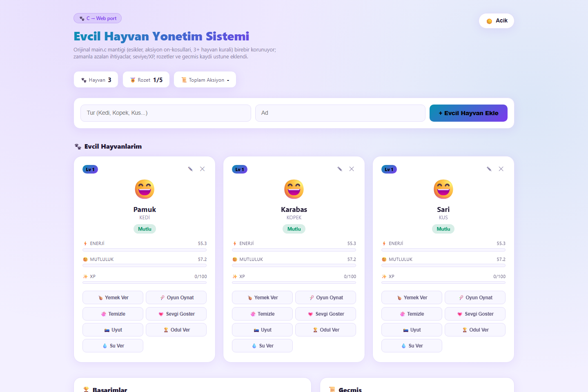

# Pet Care Simulator


> A Tamagotchi-style virtual pet care simulator with a FastAPI backend and a live, animated web UI — feed, play with, and take care of your pets while their stats decay in real time, in the background, whether you're watching or not.

---

## Overview

Pet Care Simulator is a full web port of an original C console program, **"Evcil Hayvan Yonetim Sistemi"** (Pet Management System). The mood-calculation logic and its exact thresholds were ported 1:1 from the original C source — including its original quirks — and wrapped in a new real-time web layer: live stat decay, an XP/level system, achievements, and action history.



## Features

- **Real-time stat decay** — each pet's energy and happiness drop continuously based on actual elapsed wall-clock time, computed server-side from timestamps (not a fake tick or client-side countdown). Come back after an hour and your pet will genuinely need attention.
- **Faithful mood engine** — mood (Happy, Sad, Crying, Sleeping, Hungry, Wants to Play) is derived from energy/happiness thresholds copied exactly from the original C `hayvanlar_duygu_durumu()` function, branch order and all.
- **XP & leveling** — every care action (feed, play, clean, show love, sleep, reward, water) grants XP; pets level up automatically at scaling XP thresholds.
- **5-badge achievement system** — First Step, 5-Day Care, Happy Family, Star Caretaker, and Crowded House, unlocked by tracking total actions, pet levels, and household size.
- **Action history log** — every action taken is timestamped and kept in a rolling log, viewable through the UI and the API.
- **Animated Tamagotchi-style UI** — pet cards with mood-driven emoji animations, live-updating XP/level progress bars, and a household gate that unlocks actions once you have 3+ pets.
- **Live polling** — the frontend polls the backend periodically so stats, moods, and achievements stay in sync without a page reload.

## Tech Stack

- **Backend:** Python, FastAPI, Pydantic
- **Templating:** Jinja2
- **Frontend:** Vanilla JavaScript, HTML, CSS (animated cards, periodic polling for live updates)
- **State:** In-memory server-side state with server timestamps driving real-time decay
- **Server:** Uvicorn (ASGI)

## Run Locally

### Prerequisites

- Python 3.11+

### Steps

```bash
git clone https://github.com/ErdoganPeker/Pet_Care_Simulator.git
cd Pet_Care_Simulator/app

# Create and activate a virtual environment
python -m venv venv
venv\Scripts\activate      # Windows
source venv/bin/activate   # macOS/Linux

# Install dependencies
pip install -r requirements.txt

# Run the app
python main.py
```

The app starts on **http://localhost:5013**.

### Run with Docker

```bash
docker build -t pet-care-simulator .
docker run -p 8000:8000 pet-care-simulator
```

The containerized app is served on **http://localhost:8000**.

## Project Structure

```
Pet_Care_Simulator/
├── app/
│   ├── main.py            # FastAPI app — routes, decay/XP/achievement logic
│   ├── requirements.txt   # Python dependencies
│   └── templates/
│       └── index.html     # Tamagotchi-style animated UI
├── main.c                 # Original C console program (ported 1:1)
├── Dockerfile
└── screenshot.png
```

## Author

**Erdogan Yasin Peker** — Computer Engineer

[GitHub](https://github.com/ErdoganPeker) · [LinkedIn](https://www.linkedin.com/in/erdogan-yasin-peker-b107ba24b/)
